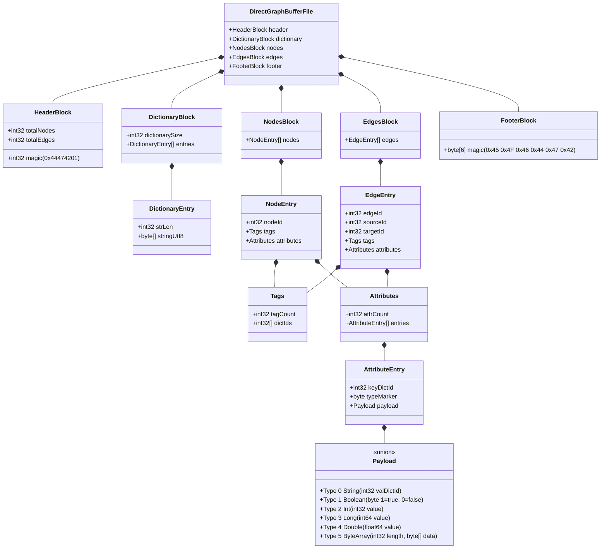

# pg-io

The `pg-io` module handles binary serialization and deserialization of property graphs. It depends strictly on the core `pg-api` module and remains completely agnostic to concrete implementations (like `pg-global` and `pg-multiverse`).

## DirectGraphBuffer (.dgb)

The primary format supported is the **DirectGraphBuffer** (`.dgb`). It is a blistering fast, bare-metal binary serialization format designed for mechanical sympathy and minimum overhead.

### File Format Specification

Below is a detailed specification of the exact byte layout of the `.dgb` file format, allowing external tools to read/write `.dgb` files independently.

### Architectural Constraints and Principles

1. **Interface Driven**: The serializer (`DirectGraphBufferWriter`) and deserializer (`DirectGraphBufferReader`) strictly interact with standard `Graph`, `Node`, and `Edge` interfaces.
2. **Zero `java.io` Overhead**: We bypass traditional `DataOutputStream` and `DataInputStream`. We leverage `java.nio.channels.FileChannel` and `ByteBuffer` for bulk memory reads/writes.
3. **The Two-Pass Guarantee**: Nodes and Edges are never interleaved. The format writes all nodes as a contiguous block, followed by all edges as a contiguous block.

### Magic Bytes and Validation

File integrity is fiercely protected to prevent catastrophic memory allocation errors:
* **Magic Header**: The first 4 bytes of a valid file are `0x44 0x47 0x42 0x01` (DGB + Version 1).
* **Magic Footer**: The last 6 bytes are `0x45 0x4F 0x46 0x44 0x47 0x42` (EOFDGB).

On read, `pg-io` instantly jumps to the end of the file (`channel.size() - 6`) to validate the magic footer. If invalid or truncated, it immediately throws a `CorruptedGraphBufferException`. It then rewinds to `channel.position(0)` to take absolute ownership of the file for the read sequence. On write, we aggressively call `channel.truncate(0)` and `channel.position(0)` to take ownership and prevent appending corruption.

### Mechanical Sympathy and Optimization

#### The 8MB Buffer Chunking
By default, the I/O system uses an 8MB buffer chunk size. This hits the "sweet spot" for modern systems: it is large enough to keep the JVM entirely out of the operating system's way, allowing the Linux kernel read-ahead prefetcher to run flawlessly, but small enough to remain inside the L3 CPU cache. The boundaries are handled gracefully using `ByteBuffer.compact()`.

#### Mathematical Stride Handoffs
The `ByteBuffer` logic is split into separate state machine methods: `readNodes()` and `readEdges()`. Nodes require a 4-byte stride (1 integer). Edges require a 12-byte stride (3 integers: edgeId, sourceId, targetId). Because we read in 8MB chunks, the buffer is perfectly handed off untouched between methods to ensure there is no partial data loss or branching complexity during the transition.

#### The IntIntMap
Because target graphs manage their own internal IDs, the file IDs must be translated back into the target's coordinate system dynamically during deserialization.
Instead of pulling in a massive 3rd-party primitive library, we implement a highly specialized open-addressed primitive map (`IntIntMap`). Because the exact number of nodes is known from the magic header, the arrays are pre-sized (2x the node count for a 0.5 load factor). It uses contiguous flat primitive arrays to ensure O(1) L1-cached linear probing during the edge reconstruction phase, with zero dynamic resizing overhead.
